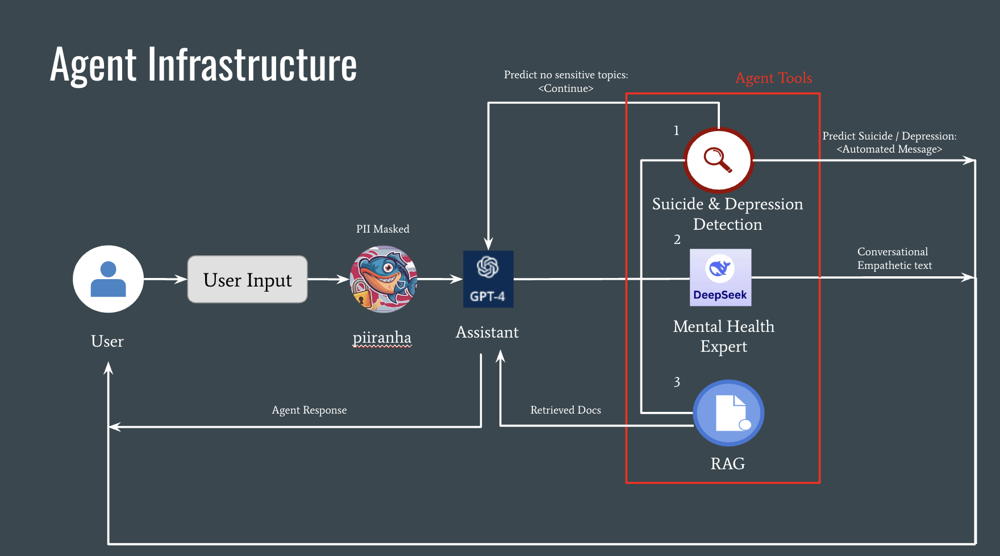

# GenZen: Mental Health Chatbot

Problem & Motivation     
36% of students seeking a bachelor’s degree considered withdrawing from their program, with 70% of them citing emotional stress as a key factor (Lumina Foundation-Gallup Study 2022). Mental health challenges among college students have been steadily increasing due to academic pressures, social challenges, and limited timely psychological support. As of 2024, as many as one-third of college students in the United States have reported moderate or severe anxiety (Healthy Minds 2024). Despite the growing need, campus mental health resources are often overburdened; college students often experience long wait times before receiving support, with the average delay for an initial counseling appointment reaching 8 days (AUCCCD Survey 2024). This gap in timely support can harm academic performance, proliferate feelings of isolation, and stunt professional development as the risk of college student attrition increases.

Our Solution  
GenZen is a 24/7 AI mental health assistant offering personalized, empathetic support. It helps students manage stress, provides academic/career guidance, and flags users needing crisis care. GenZen does not replace therapy but instead bridges the gap in supporting common college stresses and anxieties. Through the app, we push to make mental health support more scalable, proactive, and immediate for students during their most transformative years. 

Data Science Approach  
GenZen incorporates the following data science techniques within its main features: 

Text classification - Suicide & Depression detection   
Supervised fine-tuning - Trained on ESConv to respond with empathy and conversational flow   
RAG - Supplement LLM responses with academic and career resources   
Agent Infrastructure using LangGraph - Dynamically determines user needs and routes to appropriate tools (e.g., classifier, RAG)   

Agent Infrastructure    
   
   

    
When a user submits input, the system first runs the text through the piirahna-v1 model to detect and anonymize personally identifiable information (PII). The anonymized text is then passed to the GPT-4.0 assistant, which interprets the message and determines whether to respond directly or invoke an agent tool. 

Suicide & Depression Detection Flow  

For each turn, the assistant invokes the Suicide & Depression Detection tool: 

Initial Model: modernBERT  
Predicts whether the user’s message indicates suicidal ideation, depression, or a miscellaneous topic.  

 
Secondary Model: Ensemble: Avg Proba  
Triggered only if depression is detected, triggers an ensemble of mental-BERT, mental-roBERTa, and modernBERT models to further classify severity into minimum, mild, or moderate/severe.  
Response logic based on prediction:  

No sensitive topic or minimum depression → Continue conversation or invoke another tool.  
Mild depression → Send an affirming message encouraging the user to seek mental health support, with links to resources. 
Moderate/severe depression or suicidal ideation → Send an urgent support message with crisis resources, including professional help guidance and the suicide hotline. 
Mental Health Expert Tool
If the user displays stress or anxiety, the assistant calls the Mental Health Expert tool, powered by a fine-tuned DeepSeek model: 

Internally infers the user's:  
Emotion type and intensity  
Problem type  
Counseling strategy (e.g., affirmation, questioning, restatement, suggestion)  
Generates an empathetic response based on the above reasoning.  
If the user opts not to receive suggestions, the DeepSeek prompt is modified to focus solely on affirmation, questioning, and restatement.  

If the strategy selected includes providing suggestions, the RAG (Retrieval-Augmented Generation) pipeline is triggered:  

Relevant academic or mental health resources are retrieved from the vector database  
The documents are passed as context for the agent’s final response  
Contextual RAG Retrieval (Inspired by Anthropic)   

To improve the relevance of retrieved documents in GenZen, we implemented a Contextual RAG method based on Anthropic’s approach. Here's how we employed it:  
 
1. Adding Context to Chunks 

Using LLaMA 3.1-8B-Instruct, each chunk is paired with a summary based on the full document. This ensures that chunks carry meaningful context, not just isolated information, helping to improve search. 

2. Dual Embedding Strategy 

Chunks are embedded with BAAI/bge-large-en-v1.5 and stored in a Qdrant vector database. At the same time, TF-IDF encodings are created to capture keyword importance and term frequency. 

3. Two Search Methods, One Result 

When a user submits a query, we run in parallel: 

Vector search (cosine similarity via Qdrant) 
BM25 search (TF-IDF-based relevance) 
Afterward, we merge, deduplicate, and rank the top N results. 
 
4. Reranking for Precision 
 
Finally, Cohere’s Rerank-English-v3.0 selects the most relevant K chunks, which are sent to the assistant as grounding context. 

 

Scalable & Secure AWS Technical Architecture Overview 

GenZen is built with a layered AWS architecture that ensures scalability, security, and speed. 

Traffic Engineering 

User requests flow through a multi-layered infrastructure: DNS resolution via Route53, TLS termination at AWS Load Balancer, and traffic management through Istio Gateway into our EKS cluster. This zero-trust architecture implements mTLS between services while the Next.js frontend handles API aggregation through dynamic route handlers that proxy requests to internal services. 

Backend Microservices Architecture 
 
Our Python-based backend leverages FastAPI for high-performance asynchronous API handling with comprehensive type safety. The system integrates: 

Redis for distributed session management 
Qdrant for vector embeddings storage for cosine similarity search 
PostgreSQL with async connection pools for persistent storage 
SageMaker endpoints running DeepSeek, ML classification, and a PII detection models 
LangGraph for orchestrating multi-stage reasoning flows with hybrid RAG integration 
Infrastructure & CI/CD 
 
Services are containerized with multi-stage Docker builds, stored in ECR, and deployed via GitOps with Kustomize overlays for environment-specific configurations. The EKS cluster implements HPA based on custom Prometheus metrics. All persistent storage uses PostgresDB with AES-256 encryption and IAM-based access controls. 
